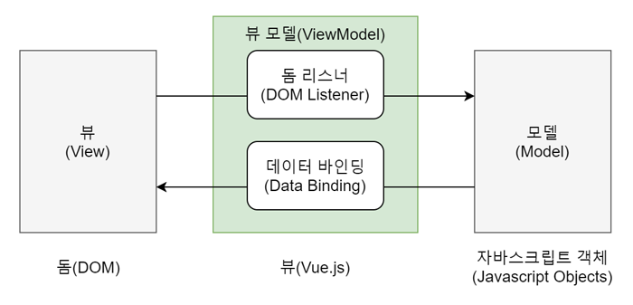
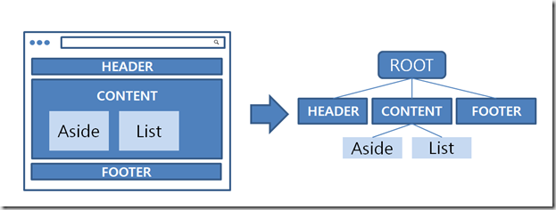

# Vue.js
---
### 1. Vue.js 란?
[Vue.js]('https://kr.vuejs.org/')는 Evan You가 만들었으며 웹 페이지 화면을 개발하기 위한 프론트엔드 프레임워크 이며 다른 여타 프론트엔드 프레임워크 보다 배우기 쉽다는 장점이 있습니다. React와 Anguler라는 프레임워크의 장점들을 쏙 빼와서 더욱 빠르고 가볍게 만든 프레임워크 입니다.

### 2. Vue.js의 특징
##### 1. UI화면단 라이브러리 MVVM 패턴
> MVVM (Model - View - ViewModel) 
> - 마크업 언어나 GUI 코드를 비즈니스 로직 또는 백엔드 로직과 분리하여 개발하는 소프트웨어 디자인 패턴 
>   간단히 말해 프론트엔드의 화면 동작과 관련된 로직과 백엔드의 데이터베이스 데이터 처리 로직을 분리하여 더 깔끔하게 코드를 구성한다는뜻

  
위의 그림에서 볼 수 있드이 MVVM 패턴은 화면을 모델(Model) - 뷰(View) - 뷰 모델(ViewModel)로 구조화 하여 개발하는 방식을 의미 합니다. 이러한 방식으로 개발하는 이유는 화면의 요소들을 제어하는 코드와 데이터 제어 로직을 분리하여 코드를 더 직관적으로 이해할 수 있고, 유지 보수가 편리하기 때문입니다. 아래 용어 설명 참고! 

| 용어 | 설명 |
|:----------|:----------|
| 뷰(View) | 사용자에게 보이는 화면 |
| 돔(DOM) | HTML문서에 들어가는 요소의 정보를 담고 있는 데이터 |
| 돔 리스너(DOM Listener) | 돔의 변경 내역에 대해 즉각적으로 반응하여 특정 로직을 수행하는 장치 |
| 모델(Model) | 데이트를 담는 용기, 보통은 서버에서 가져온 데이터를 javascript 객체 행태로 저장 |
| 데이터 바인딩(Data Binding) | 뷰(View)에 표시되는 내용과 모델의 데이터를 동기화 |
| 뷰 모델(ViewModel) | 뷰와 모델의 중간 영역. 돔 리스너와 데이터 바인딩을 제공하는 영역 |

---

##### 2. 컴포넌트 기반 프레임워크
뷰가 가지는 하나의 특징은 바로 컴포넌트(Component) 기반 프레임워크 입니다.

  
컴포넌트(Component)란 마치 레고 블록과 같습니다. 레고 블록을 잘 조합해서 쌓으면 원하는 모형을 만들 수 있듯이 Vue의 컴포넌트를 조합하여 화면을 구성할 수있습니다. 위 그림의 왼쪽 화면은 각 영역을 컴포넌트로 지정하여 구분한 것이고, 오른쪽 그림은 왼쪽 화면의 각 컴포넌트 간의 관계를 나타낸 그림입니다.

***
##### 참고자료
https://joshua1988.github.io/web-development/vuejs/vuejs-tutorial-for-beginner/ 

소중한 자료 감사합니다 😀
***
    
