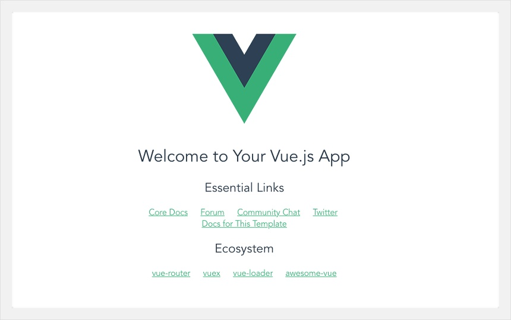

# Vue.js 설치 및 프로젝트생성
---
Vue.js를 사용하는 CDN 방식과 CLI방식 2가지 있습니다.

### 1. Vue.js CDN 및 소스

1. CDN
   - https://unpkg.com/vue 주소를 script 태그에 직접 추가

```
<script src="https://unpkg.com/vue"></script> 

```

2. Vue.js 소스코드
   - 개발용, 배포용 버전을 다운 받아 script 태그에 추가
   - 개발용 버전은 개발에 도움이 되는 모든 경고를 출력하기 때문에 개발 중에만 사용하고 실제 서비스는 배포용 버전을 사용합니다.
> - 개발용 https://kr.vuejs.org/js/vue.js
> - 배포용 https://kr.vuejs.org/js/vue.min.js

### 2. Vue.js CLI

1. 아래 npm 명령어를 통해 설치

```
$ npm install vue
npm WARN saveError ENOENT: no such file or directory, open '/Users/caley/package.json'
npm notice created a lockfile as package-lock.json. You should commit this file.
npm WARN enoent ENOENT: no such file or directory, open '/Users/caley/package.json'
npm WARN caley No description
npm WARN caley No repository field.
npm WARN caley No README data
npm WARN caley No license field.

+ vue@2.5.17
added 1 package from 1 contributor and audited 1 package in 1.232s
found 0 vulnerabilities
```

2. 설치 완료후 공식 CLI 설치

```
$ npm install --global vue-cli
npm WARN deprecated coffee-script@1.12.7: CoffeeScript on NPM has moved to "coffeescript" (no hyphen)
/usr/local/bin/vue -> /usr/local/lib/node_modules/vue-cli/bin/vue
/usr/local/bin/vue-init -> /usr/local/lib/node_modules/vue-cli/bin/vue-init
/usr/local/bin/vue-list -> /usr/local/lib/node_modules/vue-cli/bin/vue-list
+ vue-cli@2.9.6
added 237 packages from 206 contributors in 9.236s
```

3. 공식 CLI 설치 후 vue 명령어 실행

```
$ vue
Usage: vue  [options]

Options:
  -V, --version  output the version number
  -h, --help     output usage information

Commands:
  init           generate a new project from a template
  list           list available official templates
  build          prototype a new project
  create         (for v3 warning only)
  help [cmd]     display help for [cmd]
```

4. 옵션에서 init를 통해 새로운 프로젝트를 생성할 수 있습니다. init옵션은 다음과 같습니다.

```
$ vue init
Usage: vue-init  [project-name]

Options:
  -c, --clone  use git clone
  --offline    use cached template
  -h, --help   output usage information
  Examples:

    # create a new project with an official template
    $ vue init webpack my-project

    # create a new project straight from a github template
    $ vue init username/repo my-project
```

5. 아래 예제 처럼 본인의 프로젝트를 만들어 볼 수 있습니다. 생성시 Y/N 선택지는 나중에 변경이 가능하기 때문에 PASS!

```
$ vue init webpack my-project // my-project 부분은 본인 마음대로 이름 지정 가능!

? Project name my-project
? Project description A Vue.js project
? Author jybaek 
? Vue build standalone
? Install vue-router? Yes
? Use ESLint to lint your code? Yes
? Pick an ESLint preset Standard
? Set up unit tests No
? Setup e2e tests with Nightwatch? Yes
? Should we run `npm install` for you after the project has been created? (recommended) npm

   vue-cli · Generated "my-project".

# Installing project dependencies ...
# ========================
....
....
# Project initialization finished!
# ========================

To get started:

  cd my-project
  npm run dev

Documentation can be found at https://vuejs-templates.github.io/webpack
```

6. 아래 명령어를 통해 로컬에서 프로젝트를 확인 할수 있습니다.

```
$ cd my-project/;npm run dev // 2개중 선택

> my-project@1.0.0 dev /Users/caley/work/my-project
> webpack-dev-server --inline --progress --config build/webpack.dev.conf.js

 95% emitting

 DONE  Compiled successfully in 2307ms                                                                                                                                  

 I  Your application is running here: https://localhost:8080
```

1. 브라우저에 https://localhost:8080 입력하면!



***
##### 참고자료
https://jybaek.tistory.com/765<br>
https://kr.vuejs.org/v2/guide/installation.html<br>

소중한 자료 감사합니다 😀
***

