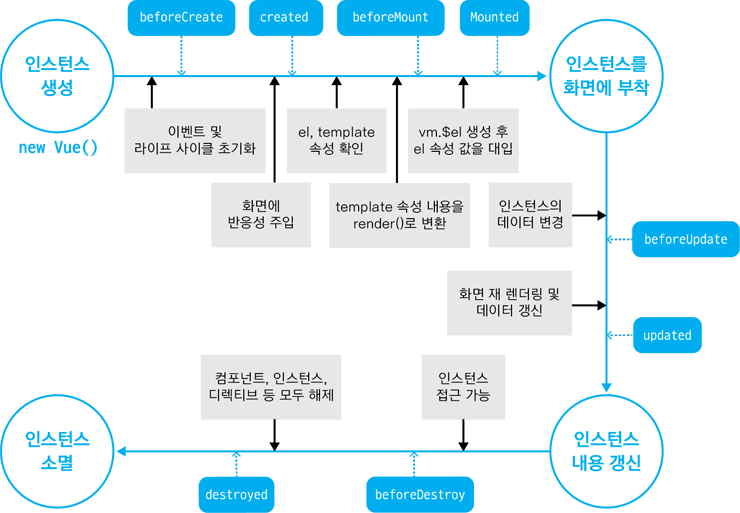

# Vue.js 인스턴스
---

#### Vue 인스턴스란?
- Vue 인스턴스란 생성된 Vue 오브젝트를 말한다.
- Vue 를 실행하기 위해 첫번째로 정의하고 생성해야 하는 객체.

***
#### Vue 인스턴스 생성
Vue 생성자로 인스턴스를 만드는 방법은 아래와 같다. <br>
Vue 인스턴스를 참조하기 위해 변수 **vm(ViewModel의 약자)**을 종종사용
```javascript
var vm = new Vue({
    el: '#app',
    template: '',
    data: {},
    props: [], // {}
    methods: {},
    computed: {},
    wath: {}
})
```
<strong>Vue 인스턴스 옵션 속성</strong>
- el : Vue가 실행될 HTML의 DOM요소를 지정
- template : 화면에 표시할 HTML, CSS 등의 마크업 요소를 정의하는 속성
- data : Vue의 반응성이 반영될 데이터
- props : 부모 컴포넌트로부터 전달 받은 property들의 array 또는 Object
- methods : 함수를 정의하고 화면의 동작과 이벤트를 정의하는 메소드
- computed : data의 값이 변화되었을 때 수행할 메소드 정의
- watch : 지정된 변수를 지켜보고 있다가 값이 변경되었을때 정의된 함수를 호출

***
#### Vue 라이프사이클
- 라이프사이클은 Vue 인스턴스의 생성부터 파괴까지의 일련의 과정을 말합니다.
- 생성 > 마운트 > 업데이트 > 파괴
- 사용자는 Vue 인스턴스를 생성할 때 라이프사이클 훅(hook)을 정의할 수 있습니다.

<br>



<strong>1. beforeCreate</strong>
<p>
    Vue인스턴스가 생성되었지만 데이터관찰, 이벤트 감시가 설정 되기 전에 호출 됨
</p>
<strong>2. created</strong>
<p>
    Vue인스턴스가 생성된 후에 데이터에 대한 관찰기능, 계산형 속성, 메서드, 감시자 설정이 완료된 후에 호출됩니다.
</p>
<strong>3. beforeMount</strong>
<p>
    created 단계 이후 template 속성에 지정한 마크업 속성을 render() 함수로 변환 후 el 속성에 지정한 화면 요소(돔)에 인스턴스를 부착하기 전에 호출되는 단계입니다. render()함수가 호출되기 직전의 로직을 추가하기 좋습니다.
</p>

***
#### Vue 라이프사이클 훅
라이프 사이클 훅은 인스턴스의 특정 시점에 원하는 로직을 구현할 수 있습니다. 예를 들어, 컴포넌트가 생성되자마자 데이터를 서버에서 받아오고 싶으면 created나 beforeMount 라이프사이클 훅을 사용할 수 있습니다. 아래 코드는 인스턴스가 생성되자마자 엑시오스로 HTTP GET 요청을 보내 데이터를 받아오는 코드입니다.
```javascript
new Vue({
    methods: {
        fetchData(){
            axios.get(url);
        }
    },
    created: function(){
        this.fetchData();
    }
})

```

***
##### 참고자료
https://velog.io/@psm8873/2019.01.12-Vue-인스턴스-7mjqyi53cl<br>
https://ux.stories.pe.kr/113<br>

소중한 자료 감사합니다 😀
***

